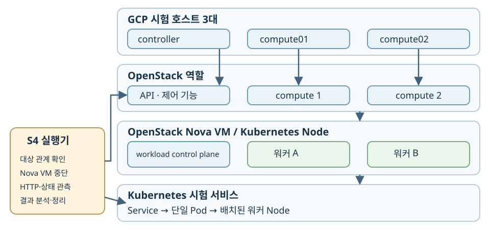
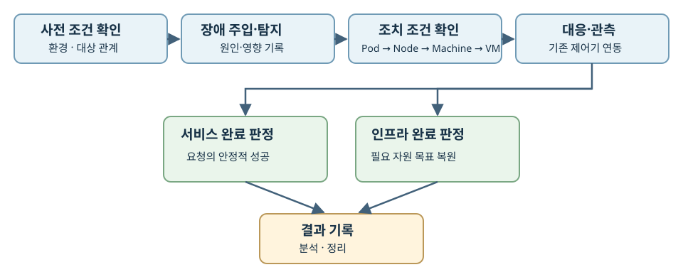
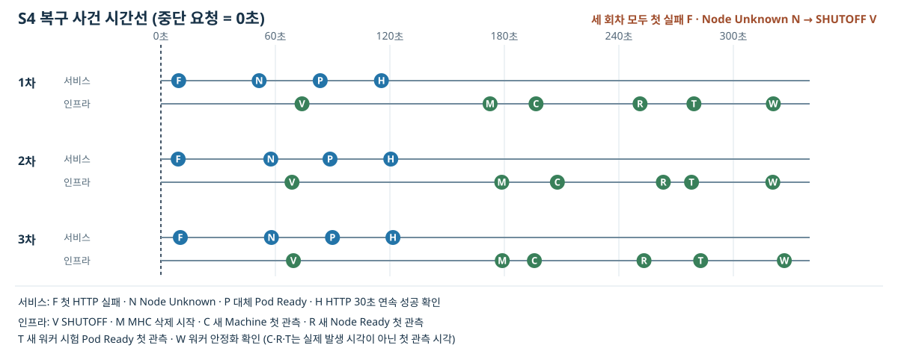

# OpenStack 기반 Kubernetes 환경에서 대표 장애 대응 자동화 모듈 프로토타입 설계 및 구현

<!-- HWP 표지에 기재할 GitHub URL: https://github.com/hyeonski/openstack-k8s -->

## 국문요약

OpenStack VM 위에서 Kubernetes 서비스를 운영하면 서비스에 나타난 장애 증상과 원인이 있는 인프라 계층이 다를 수 있다. Kubernetes의 기본 자가복구를 활용하더라도, 어느 VM이 어떤 서비스에 영향을 주는지 확인하고 장애 유형에 맞는 조치를 선택하며 실제 회복을 검증하는 절차가 필요하다. 본 작품은 Kubernetes와 OpenStack의 자원 관계를 연결하고, CPU 경합·네트워크 혼잡·상태 저장 서비스의 노드 장애·워커 VM 중단에 대한 탐지 근거, 1차 대응, 완료 조건을 정의한다.

중간 단계에서는 공통 실행 기반과 워커 VM 중단 시나리오(S4)를 구현했다. 실행기는 장애 주입 대상을 확인해 실제 Nova VM을 중단하고, Kubernetes 및 Cluster API 계열 제어기의 Pod 재배치와 대체 VM 생성을 관측·기록한다. 실환경 실행 3회에서 서비스는 첫 관측 HTTP 실패부터 30초 연속 성공 확인까지 약 106~111초, 워커는 VM의 SHUTOFF 확인부터 목표 워커 2대와 새 워커 시험 Pod의 안정화 확인까지 약 247~257초가 걸렸다. 이 수치는 해당 환경·설정에서 관측한 회복·판정 시간이며 실행기 자체의 속도 개선 효과를 입증하지 않는다. 세 회차 모두 전체 경로가 완료됐고, **서비스 회복과 인프라 용량 복원을 독립적으로 판정하는 절차**가 현재 프로토타입의 핵심 결과다. S1은 CPU 경합과 사전에 지정한 목적지로의 스크립트 재배치까지 예비 실측했으며, 자동 장애 판단·목적지 선택과 S2·S3 구현·비교 평가는 최종 단계에서 수행한다.

**주요어:** OpenStack, Kubernetes, 장애 대응 자동화, Cluster API, 복구 검증

## 1. 서론

### 1.1 제안 배경 및 필요성

OpenStack 가상 인프라 위에 구축한 Kubernetes 클러스터에서 서비스 요청은 Service와 Pod를 통해 처리된다. Pod는 Node에서 실행되고, 이 Node는 Nova VM과 대응한다. VM은 OpenStack 컴퓨트 호스트(compute)·가상 네트워크·스토리지에 의존한다. 운영자가 HTTP 오류를 먼저 발견했을 때 Pod의 상태만 살펴서는 원인이 애플리케이션, VM, 공유 호스트 자원, 네트워크 중 어디에 있는지 알기 어렵다. 반대로 OpenStack에서 VM 이상을 발견했을 때도 영향을 받은 Pod와 서비스를 찾아야 복구 대상을 정할 수 있다. 따라서 계층 간 자원 관계 확인은 자동 조치의 출발점이다.

장애 조사에는 두 방향의 추적이 필요하다. 서비스 오류에서 출발할 때에는 그 시점의 Pod 배치, Node 상태, 대응 VM과 포트를 따라 내려간다. 인프라 경보에서 출발할 때에는 해당 VM을 사용하던 Node·Pod와 서비스 요청의 변화를 따라 올라간다. 이 관계는 Pod 재배치나 Machine 교체 중에 바뀔 수 있으므로 과거에 저장한 이름 목록만으로 조치 대상을 결정해서는 안 된다. 또한 요청 오류와 높은 CPU 사용률이 동시에 보였다고 해서 두 사건 사이의 원인이 자동으로 확정되는 것은 아니다. 본 작품은 서비스 영향, 계층 간 식별자, 시나리오별 추가 증거를 조합해 조치 여부를 정한다.

Kubernetes는 실패한 컨테이너를 재시작하고, 선언한 복제본 수에 맞게 Pod를 다시 만들며, 사용할 수 없는 Node의 워크로드를 다른 Node로 옮길 수 있다[1]. Cluster API의 MachineHealthCheck(MHC)는 설정한 조건에 따라 비정상 Machine의 복구를 시작할 수 있다[2]. 이 기능들은 S4의 복구에서 실제로 활용된다. 예를 들어 워커가 두 대인 클러스터에서 한 VM이 중단되면 서비스 Pod는 여유가 있는 다른 워커로 이동해 먼저 응답할 수 있다. 그러나 대체 워커가 아직 생성되지 않았다면 클러스터의 정상 워커 수는 한 대다. 서비스 요청의 안정화와 목표 워커 수의 복원은 각각 확인해야 하는 사건이다.

VM과 Node가 정상으로 표시돼도 API 응답은 CPU 경합이나 송신 경로의 혼잡으로 악화될 수 있다. 상태 저장 서비스에서는 Node와의 통신 두절이 기존 데이터베이스 프로세스의 종료를 보장하지 않는다. 이 경우 Pod 재시작을 곧바로 복구 조치로 선택하면 원인을 해결하지 못하거나 동일 볼륨에 대한 중복 실행 위험을 남긴다. 본 작품은 서비스 영향과 인프라 증거를 함께 확인한 뒤, 확인된 장애 유형에만 사전에 정의한 1차 대응을 적용한다.

따라서 CPU 경합에는 다른 컴퓨트로의 배치가, 네트워크 혼잡에는 경쟁 작업의 분리와 제한이, 상태 저장 서비스에는 기존 실행의 종료 확인과 데이터 검증이 각각 필요하다. 조치 조건을 구체적으로 정의하고 근거가 부족하면 보류 사유를 남겨야 진단 실패와 복구 실패도 구분할 수 있다.

### 1.2 목표와 평가 기준

본 작품의 목표는 OpenStack의 VM·가상 네트워크와 Kubernetes의 Node·Pod·Service에 걸친 대표 장애의 탐지, 1차 대응, 결과 검증을 재현 가능한 절차로 만드는 것이다. 실행 시점에는 Pod의 배치 Node, Machine의 nodeRef, Machine.spec.providerID(OpenStack VM 식별자)를 이어 Service–Pod–Node–Machine–Nova VM 관계를 검증한다. S4에서는 이 관계가 명확할 때만 장애를 주입할 Nova VM을 선택하고, 복구 대상의 선택과 교체는 기존 제어기에 맡긴다. 이후 S1 자동 대응에서는 서비스 영향과 인프라 증거를 확인한 뒤 조치 목적지를 선택하도록 확장한다. 완료 여부는 자원의 상태 표시와 실제 서비스 요청을 함께 확인해 판정한다.

초기 신청서에는 지속적인 워커 Node 비정상, Pod 반복 실패, Ingress controller 접근 실패를 대표 장애의 예로 제시했다. 설계를 구체화하면서 증상만으로는 OpenStack 자원의 어떤 상태를 확인하고 어디에 조치해야 할지 결정할 수 없음을 확인했다. 이에 신청서의 다계층 장애 자동 대응이라는 목적은 유지하고, 서비스 영향·인프라 원인 후보·조치 대상·완료 조건을 시험할 수 있는 S1~S4로 대상 사례를 다시 정의했다. 신청서의 세 사례를 모두 구현했다는 의미는 아니다.

신청서의 계획과 중간 단계의 구현 범위 차이는 부록 A의 표 11에 정리했다.

S4의 인프라 복구에는 Cluster API(CAPI)와 Cluster API Provider OpenStack(CAPO)을 사용한다. CAPI는 Kubernetes Machine 자원의 목표 상태를 관리하고 CAPO는 OpenStack VM에 해당하는 인프라 자원을 제공한다. 이 도구와 Kubernetes 자체 기능이 수행한 복구는 실행기가 관측·검증하는 대상으로 둔다.

**표 1. 대표 장애 시나리오와 대응 설계**

| 구분 | 장애 조건·탐지 근거 | 1차 대응 | 완료 조건 | 중간 단계 상태 |
|---|---|---|---|---|
| S1 | 동일 컴퓨트의 VM 간 CPU 경합과 API 지연 | 다른 컴퓨트의 워커로 API Pod 재배치 | 목표 응답 회복, 새 배치·복제본 확인 | 지정 목적지 재배치 예비 실측·자동 판단 설계 |
| S2 | 공통 송신 경로 혼잡과 API 지연 | 업로드 작업 분리, 해당 VM 포트의 Neutron QoS 조정 | API 회복과 업로드 진행 | 설계 |
| S3 | Node 제어 통신 두절과 DB 접근 실패 | 기존 VM 종료 확인 후 Cinder 볼륨 재연결·DB 재기동 | 데이터 보존, 새 읽기·쓰기 성공 | 설계 |
| S4 | 워커 VM 중단과 HTTP 서비스 실패 | Kubernetes Pod 재배치, MHC·CAPI·CAPO의 대체 VM 생성 관측 | HTTP 30초 이상 연속 성공, 정상 워커 2대와 새 워커 실행 확인 | **구현·기본 검증** |

본 작품의 기여는 다음 세 가지다.

1. providerID 등을 기준으로 Kubernetes와 OpenStack 자원 관계를 실행 시점에 검증하고, 관계가 불명확하면 대상 선택을 보류하는 절차
2. CPU·네트워크·상태 저장 서비스·VM 중단의 네 시나리오에 대한 탐지 근거, 1차 조치, 안전 조건, 완료 조건의 정의
3. 서비스 안정화와 필요한 인프라 상태를 독립적으로 판정·기록하는 실행 기반과, 이를 실제 워커 VM 중단에 적용한 3회 실환경 검증

첫 번째 항목은 S4의 **장애 주입 대상** 선택에 적용해 검증했다. S4의 복구 조치 대상은 직접 고르지 않았으며, 복구 목적지의 자동 선택은 S1 후속 구현 범위다. 세 번째 항목은 S4에서 구현·기본 검증했다. 두 번째 항목 중 S1은 지정 목적지 재배치까지 예비 실측했고 자동 판단은 설계 단계이며, S2·S3의 대응 실행도 설계 단계다. 최종 평가에서는 표 1의 각 완료 조건과 조치 비용을 시나리오별로 측정한다.

### 1.3 작품 개요와 중간 결과

시험 환경에는 물리 서버 대신 GCP Compute Engine 인스턴스(VM) 세 대를 사용해 OpenStack controller 한 대와 컴퓨트 두 대를 구성했다. 이 컴퓨트에서 구동한 Nova VM 위에 Kubernetes 클러스터를 배치했다. 두 컴퓨트는 별도 인스턴스에서 동작하지만, Google Cloud 하부 물리 서버의 배치는 확인하지 않았다. 실행기는 OpenStack과 Kubernetes API를 통해 대상 관계를 확인하고 상태를 기록한다. 중간 단계에는 워커 2대와 단일 복제본의 상태 비저장 HTTP 시험 서비스를 사용했다. 그림 1은 이 논리 계층과 S4 실행기의 관측·제어 경로를 나타낸다.

그림 1. 시험 환경의 논리 계층과 S4 실행기 경로

공통 실행 흐름은 환경·대상 관계 확인, 장애 주입 또는 탐지, 상태·관계·안전 조건 확인, 시나리오별 대응·관측, 서비스·인프라 완료 판정, 분석·정리로 이어진다(그림 2). S4에서는 VM 중단 **전에** Pod–Node–Machine–Nova VM 관계를 검증한다. 실행 ID 아래에 HTTP 요청, Pod·Node·Machine, Nova VM의 상태와 시각을 기록한다. 환경 준비와 시나리오 실행은 독립적으로 수행할 수 있어 기존 클러스터를 재사용할 수 있다. 실행 후에는 시험 자원과 정책을 정리하고 원래 워커 제어 상태를 복원한다.

그림 2. 대표 장애 시나리오의 공통 실행 흐름

S4에서는 워커 전용 MHC를 설정하고, 대상 Node–Machine–Nova VM의 관계를 확인한 뒤 VM 한 대를 실제로 중단했다. Kubernetes는 남은 워커에 대체 Pod를 실행했고, MHC·CAPI·CAPO는 장애 Machine과 VM의 교체를 담당했다. 직접 작성한 실행기는 정확한 대상 선택, 장애 주입, 상태 관측, 두 완료 조건의 판정, 원본 분석과 정리를 수행했다. 서비스 복구와 VM 교체에 쓰인 기존 제어기의 역할을 이 실행기의 역할과 구분해 기록했다.

코드와 설정을 고정한 재실행 3회에서 첫 관측 HTTP 실패부터 30초 이상 연속 성공을 확인하기까지 각각 약 106초, 111초, 111초가 걸렸다. Nova VM의 SHUTOFF 확인부터 목표 워커 2대 복원과 새 워커 실행 검사 완료까지는 각각 약 247초, 252초, 257초였다. SHUTOFF 확인은 서비스 영향보다 늦었으므로, 4장에서는 중단 요청 시각을 기준으로 한 경과 시간도 함께 제시한다.

세 번의 실행에서 공통으로 확인된 것은 장애 대상 VM의 중단, 기존 Pod의 대체 실행, HTTP 응답의 안정화, 새 워커의 합류와 시험 자원의 정리까지 이어지는 전체 경로다. 실행 중 발생한 요청 실패와 각 제어 단계는 원본 기록에 남겨 결과를 다시 계산할 수 있게 했다. 처음 정상 응답한 시점과 안정화 판정을 완료한 시점은 다르며, 서비스 회복 기준에는 안정화 판정 완료 시점을 사용한다. 이러한 사건 정의를 고정해야 최종 단계에서 다른 실행이나 기본 기능과 비교할 때도 같은 의미의 수치를 사용할 수 있다.

### 1.4 검증 범위

중간 결과는 한 종류의 VM 중단 장애에서 전체 실행 경로가 동작했음을 보여준다. 세 실행에서 기록한 S4 핵심 코드·설정 파일의 해시가 일치한다. HTTP 검사는 Kubernetes API Service proxy 경로로 수행됐으므로 ingress 중단 시간은 측정하지 않았다. 세 회차만으로 복구 성능의 통계적 분포를 추정할 수도 없다. S1의 자동 대응과 S2·S3의 대응 구현, 조건을 고정한 반복·비교 시험은 최종 단계의 범위다. 요청 간격과 타임아웃 등 측정의 세부 제약은 4장에서 다룬다.

### 1.5 보고서 구성

2장에서는 관련연구 여섯 편의 관측 정보·제어 범위·평가 대상을 비교한다. 3장은 시스템 구성과 공통 기반, 대표 장애별 대응 설계를 소개한다. 4장은 구현 및 S4 기본 검증 결과를 분석한다. 5장은 중간 성과와 최종 단계 계획 및 구현 경험을 정리한다.

## 2. 관련연구

OpenStack과 Kubernetes의 장애 대응에는 상태 관측, 계층 간 신호 연결, 복구 조치, 서비스 결과 확인이 필요하다. 국문 논문 세 편과 영문 논문 세 편을 이 네 관점에서 검토했다. 각 연구의 입력 장애와 평가 지표를 구분해 본 작품의 대응 범위를 정한다.

김지용 외[3]는 OpenStack에서 운영하는 Kubernetes·서비스 메시 환경의 통합 모니터링 시스템을 제안했다. 서비스 지표와 인스턴스 CPU·메모리, Kubernetes 관련 지표를 함께 수집·시각화하여 기반 인프라의 상태를 볼 수 있게 했다[3]. 이 연구의 초점은 운영자에게 다양한 계층의 지표를 제공하는 것이다. 본 작품은 이 관측 관점을 바탕으로 장애 시점의 Pod–Node–VM 관계를 식별하고, 확인된 대상에 대한 조치와 결과를 같은 실행에 기록한다.

박주원 외[4]는 OpenStack의 시스템·응용 서비스 계층에서 발생한 이벤트 로그를 모아 메시지별로 군집화하고 오류 원인의 연관성을 분석했다. 분산 로그의 시각이 정확히 일치하지 않을 때의 패턴 비교에는 동적 시간 왜곡 기법을 사용한다[4]. 여러 위치의 증거를 하나의 사건으로 연결한다는 점에서 본 작품의 장애 기록과 접점이 있다. 본 작품은 로그 군집화 대신 서비스 요청 결과와 Kubernetes·OpenStack 자원 상태를 실행 ID로 연결하고, Node·VM·포트의 식별자를 조치 전에 검증한다.

박신영 외[5]는 AWS·Azure·GCP에 걸친 Kubernetes 클러스터를 통합 관측하는 대시보드를 제안했다. 한 클라우드에 장애가 나면 다른 클라우드에서 서비스를 자동 복구하는 기능도 소개했다[5]. 이는 관측 결과를 서비스 복구로 연결하는 사례다. 다만 제어 단위는 클라우드 간 전환인 반면, 본 작품은 한 OpenStack 환경 내부의 Pod·Node·VM, 가상 네트워크와 볼륨을 대상으로 한다.

Yang과 Kim[6]은 OpenStack의 Ceilometer·Aodh가 감지한 VM 장애 신호를 Fast Fault Detection Manager를 통해 Kubernetes에 전달하는 구조를 구현했다. Kubernetes의 Node 상태 확인에 의존하는 방식과 비교하여 VM 장애 탐지 시간을 평가하고, 워커 수 및 CPU·네트워크 부하를 변화시키며 탐지 지연을 살폈다[6]. 이 연구의 측정 종료점은 Kubernetes가 장애 정보를 받은 때다. 본 작품은 이를 계층 간 신호 전달의 선행 사례로 참고하며, S4에서는 VM 중단부터 서비스 안정화와 새 워커 준비까지의 사건을 별도로 기록한다.

Vayghan 외[7]는 상태 저장 마이크로서비스의 가용성 문제를 분석하고 HA State Controller를 제안했다. 이 제어기는 상태 복제와 정상 인스턴스로의 서비스 경로 전환을 결합하며, 가용성과 확장 비용을 평가했다[7]. 인스턴스 수리와 실제 서비스 제공을 구분한 점이 본 작품의 완료 판정과 연결된다. 본 작품의 S3은 복제 대신 단일 PostgreSQL 인스턴스의 기존 VM 종료와 동일 Cinder 볼륨의 안전한 재연결을 설계하고, 데이터 보존과 새 읽기·쓰기를 확인한다.

Flora 외[8]는 TeaStore와 SockShop에서 부하와 결함을 변화시키며 Kubernetes probe의 탐지 효과를 실험했다. 시험한 응용 실패 중에는 probe가 감지하지 못한 경우가 있었고, 논문은 건강 검사 엔드포인트와 주기·타임아웃 설정의 중요성도 논의한다[8]. 논문의 IV-A절(BP4)은 probe 설계 지침으로 검사 주기가 길면 장애 상태가 오래 남을 수 있고, 타임아웃이 지나치게 짧으면 오탐 가능성이 높아진다고 설명한다[8]. 본 작품은 Pod 상태와 별도로 실제 서비스 요청을 검사하고, 시나리오에 맞는 안정화 조건을 완료 판정에 사용한다.

**표 2. 관련연구의 관측 정보와 복구 범위 비교**

| 연구 | 주로 다룬 정보·계층 | 계층 연결 또는 방법 | 자동 조치·평가 대상 | 서비스 결과 확인과의 관계 |
|---|---|---|---|---|
| 김지용 외[3] | 서비스 메시·인스턴스·Kubernetes 지표 | 지표 통합 시각화 | 관측 시스템 | 운영자의 상태 확인 지원 |
| 박주원 외[4] | OpenStack 시스템·서비스 이벤트 로그 | 메시지 군집·연관 분석 | 오류 원인 파악 | 해당 없음(원인 분석 단계) |
| 박신영 외[5] | 멀티 클라우드 Kubernetes 상태 | 클러스터 통합 관측 | 다른 클라우드로 서비스 복구 | 클라우드 간 전환 사례 |
| Yang과 Kim[6] | OpenStack VM 장애 신호 | VM 경보를 Kubernetes로 전달 | VM 장애 탐지 시간 | 서비스 회복 시간과 구분 |
| Vayghan 외[7] | 상태 저장 마이크로서비스 | 상태 복제·경로 전환 | 정상 인스턴스로 자동 전환 | 서비스 가용성 평가 |
| Flora 외[8] | 응용 요청·Kubernetes probe | 부하·결함 주입 평가 | probe의 탐지 효과 | 사용자 작업과 probe 결과 비교 |
| 본 작품 | 서비스 요청·Kubernetes·OpenStack 상태 | providerID 등 자원 관계 검증 | 시나리오별 조치; 중간 단계 S4 검증 | 서비스 안정화·필요 인프라 복원 분리 |

관측 지표와 로그를 통합한 연구[3][4], VM 장애 신호를 전달한 연구[6], 서비스를 다른 위치에서 회복한 연구[5][7], 건강 검사의 효과를 평가한 연구[8]는 각각 대응 과정의 다른 단계를 설명한다. 본 작품은 **관계 확인 → 조건 판정 → 조치 → 서비스·인프라 결과 확인**을 한 실행 기록으로 연결한다. 중간 단계에서 이 흐름을 실환경으로 확인한 사례는 S4이며, S1의 자동 대응과 S2·S3의 효과는 최종 단계에서 검증한다.

## 3. 제안 작품 소개

### 3.1 이론적 배경

Kubernetes는 Node의 상태와 Lease 갱신을 통해 워커의 생존 여부를 판단한다. Node와 통신이 끊기면 Ready 상태가 Unknown으로 바뀌고 unreachable taint가 붙는다[9][10]. 기존 Pod가 언제 축출되는지는 이 taint에 대한 tolerationSeconds에 영향을 받는다. Kubernetes는 명시적 설정이 없으면 not-ready와 unreachable에 각각 300초의 toleration을 추가한다[10]. 시험 서비스에는 각각 30초를 명시했다. 짧은 일시적 통신 단절에는 대기하되, 한 번의 실험에서 Pod 재배치를 관측할 수 있도록 대기 시간을 줄인 설계 선택이다. 따라서 중단 요청 직후 Pod가 옮겨지는 것이 아니라 Node 이상 판정과 toleration 대기 뒤에 대체 Pod가 준비된다. Kubernetes v1.35의 node-monitor-grace-period와 node-monitor-period 공식 기본값은 각각 50초와 5초지만, 이번 실행에서는 컨트롤러의 실효 플래그를 별도로 저장하지 않았다[9][11]. 4장은 기본값을 원인으로 단정하는 대신 실제 Ready 전이와 Pod 축출 시각을 사용한다.

Cluster API(CAPI)는 관리 클러스터에서 워크로드 클러스터의 목표 상태를 관리한다. 워커는 Cluster → MachineDeployment → MachineSet → Machine 관계에 있으며, Machine의 infrastructureRef가 OpenStackMachine을 가리킨다[12]. S4 대상 선택은 Pod가 배치된 Node를 Machine의 nodeRef와 연결하고, Machine.spec.providerID의 openstack:///UUID를 Nova 서버 ID와 대조한다. 이름이 비슷하다는 이유만으로 VM을 선택하지 않는다. 이 관계는 장애 복구 과정에서 Machine과 Node가 교체되므로 주입 직전 다시 확인해야 한다.

MachineHealthCheck(MHC)는 선택한 Machine의 Node 조건이 지정한 시간 동안 비정상이면 복구를 요청한다[2]. S4의 MHC는 워커 MachineDeployment만 선택하고 Ready Unknown·False가 120초 지속될 때 대응하며, 비정상 워커가 1대를 넘으면 자동 조치를 중단한다. 120초는 30초 Pod 축출과 분리해 단기적인 Node 상태 변화만으로 VM을 교체하지 않으려는 시험 설정이다. 오탐과 복구 시간의 최적 균형을 검증한 값은 아니다. MHC·CAPI·CAPO는 장애 Machine의 삭제와 대체 VM 생성을 담당하고, 본 작품의 실행기는 대상 식별·관측·완료 판정을 담당한다. 서비스 Pod가 다른 워커에서 먼저 응답하더라도 새 VM과 Node의 생성은 계속 진행될 수 있다.

나머지 시나리오에서는 OpenStack의 다른 제어 기능을 사용할 계획이다. S1은 Nova에서 VM의 컴퓨트 배치를 확인해 CPU 경합이 있는 위치와 목적지를 구분한다. S2는 업로드 VM의 Neutron 포트에 적용할 QoS 정책을 검토한다[13]. S3은 Nova 전원 상태와 Cinder 볼륨 attachment를 확인해 기존 데이터베이스 실행이 남은 상태에서 동일 볼륨을 다시 사용하지 않도록 설계한다[14]. 현재 설치 설정에는 Cinder가 꺼져 있고 Neutron QoS 활성화도 명시되지 않았다. S2·S3의 동작과 안전성은 해당 기능과 저장소 연동을 준비한 후에 검증해야 한다.

### 3.2 시스템 구성과 실험 설정

그림 1의 상단은 GCP 시험 호스트, 중간은 OpenStack과 관리 클러스터, 하단은 Nova VM에서 동작하는 워크로드 클러스터를 나타낸다. 관리용 kind 클러스터는 GCP controller 호스트에서 동작하며 CAPI·CAPO·MHC와 Cluster Autoscaler를 실행한다. Python 실행기와 HTTP 검사 클라이언트는 실험을 시작한 로컬 작업 컴퓨터에서 동작하고, OpenStack 관리 명령은 controller 호스트에서 실행한다. 실행기와 검사기를 장애 대상 워커 밖에 두어 워커가 중단돼도 관측 경로를 유지한다. 단일 복제본의 상태 비저장 HTTP 서비스는 워크로드 클러스터의 워커에 배치한다. 현재 구성의 두 OpenStack 컴퓨트는 별도 GCP 인스턴스이지만 Google Cloud 하부 물리 서버의 배치는 확인하지 않았다.

Cluster Autoscaler는 평상시 워커 수를 자동 조정하기 위해 설치했다. S4 준비 단계에서는 이 Deployment를 0개 복제본으로 멈추고 워커 MachineDeployment를 2대로 고정한다. 준비 검사에서 Autoscaler 중지·워커 2대 안정화를 확인하므로, S4 동안 워커 교체는 Autoscaler의 증설과 구분된다. 실험 뒤에는 기록해 둔 원래 제어 모드(`auto`)와 워커 수(1대)로 복원한다.

**표 3. 시험 환경의 주요 구성(설치 설정 기준)**

| 구분 | 구성 |
|---|---|
| GCP 시험 호스트 | controller: e2-standard-4 1대; OpenStack 컴퓨트: n2-standard-4 2대 |
| 가상화 | 컴퓨트 두 대의 중첩 KVM 활성화; controller는 비활성화 |
| OpenStack | Kolla 설치 설정 2025.2; Nova·Neutron 운영, Cinder 비활성(`enable_cinder: "no"`); Neutron QoS 활성화·실효 지원은 아직 미검증 |
| Kubernetes | 관리 클러스터 kind v1.35.0; 워크로드 클러스터 v1.35.7 |
| Cluster API | CAPI v1.13.4; CAPO v0.14.6 |
| 제어·검사 위치 | 관리용 kind·Cluster Autoscaler: GCP controller; Python 실행기·HTTP 검사: 로컬 작업 컴퓨터 |
| 워커 flavor | 2 vCPU, 메모리 2048 MiB, 디스크 20 GB; S4 시작 시 워커 2대 |
| 시험 서비스 | 단일 복제본 BusyBox HTTP 서비스; 워커에만 배치, 영구 볼륨 없음 |

**표 4. S4의 판정·관측 설정**

| 항목 | 값과 역할 |
|---|---|
| Node 감시 | 별도 오버라이드 기록 없음; v1.35 공식 기본 grace 50초·period 5초, 실효값은 미수집 |
| Pod 축출 | 기본 300초[10] 대신 not-ready·unreachable NoExecute toleration 각각 30초(시험 서비스에 명시) |
| MHC | Ready Unknown·False 120초(시험 설정); Node 시작 대기 900초; 비정상 워커 1대까지만 자동 대응 |
| 워커 제어 | 실험 중 Cluster Autoscaler 0개 복제본·워커 목표 2대; 실험 후 원래 `auto`·1대 복원 |
| Pod 자체 probe | readiness 3초 주기·2초 제한, liveness 10초 주기·2초 제한 |
| 외부 HTTP 검사 | 응답 또는 타임아웃 뒤 1초 대기; 요청 제한 5초; Kubernetes API Service proxy 경로 |
| 인프라 스냅샷 | 각 조회·저장 완료 뒤 5초 대기; 세 회차의 실제 연속 시작 간격은 약 13.3~15.1초 |
| 완료 판정 | HTTP 연속 성공 30초 이상; 정상 워커 2대·새 워커 시험 Pod 실행을 30초 이상 확인 |

표 4의 1초는 요청 **시작 간격**이 아니라 이전 요청 종료 후 대기 시간이다. 성공 요청은 응답 시간만큼, 타임아웃 요청은 최대 5초만큼 다음 표본이 늦어진다. 스냅샷도 5초마다 정확히 찍히는 것이 아니라 여러 API 조회에 걸린 시간이 추가된다. 이 차이를 4장의 요청 수와 첫 관측 사건의 정밀도 해석에 반영한다.

### 3.3 실행기 설계와 안전 조건

실행기는 Python과 Makefile 진입점으로 구성했다. 환경 준비는 기존 호스트·게스트·클러스터가 정상인지 확인하고 필요한 것만 기동한다. 시나리오 실행은 준비된 환경을 다시 검증한 뒤 시험 자원 설치, 장애 주입, 관측, 분석, 소유 자원 정리의 순서로 진행한다. 두 단계는 독립 실행하거나 연결해서 실행할 수 있다.

**표 5. S4 실행기의 모듈과 기록**

| 단계 | 직접 구현한 기능 | 주요 기록 |
|---|---|---|
| 준비·대상 확인 | 워커 2대·MHC 범위·HTTP 기준선, Pod–Node–Machine–Nova 관계 확인 | baseline.json, run.json |
| 주입·관측 | 한 Nova VM의 stop 요청과 SHUTOFF 확인, HTTP·인프라 상태 수집 | stopped-nova.json, http.jsonl, observations/ |
| 독립 판정·분석 | 서비스 30초 연속 성공과 새 워커 30초 안정화, 사건별 UTC 시간 재계산 | result.json, analysis/summary.json·CSV |
| 정리 | 시험 소유 자원 제거, 원래 워커 제어 모드·대수 복원 | finalization.json |

S4 대상 검증의 순서는 다음과 같다. (1) 시험 서비스의 Ready Pod가 정확히 하나이고 두 워커 Machine이 정상인지 확인한다. (2) Pod의 nodeName과 Machine의 nodeRef가 일대일로 대응하는지 검사한다. (3) Machine의 providerID를 Nova ID로 해석하고, 준비 기록의 Machine UID 및 현재 Nova ACTIVE 상태와 다시 대조한다. (4) 워커 전용 MHC가 control plane을 선택하지 않고 다른 MHC와 범위가 겹치지 않는지 확인한다. 관계가 하나라도 불명확하거나 이전 실험이 정리되지 않았으면 VM 중단을 보류한다. stop 명령을 보냈다는 기록과 실제 SHUTOFF 확인을 따로 남겨 명령 접수만으로 장애 주입 성공을 선언하지 않는다.

각 실행에는 run ID, 환경 준비 ID, 원래 워커 상태, 대상 UID·Nova ID, 중단 요청 및 확인 시각을 저장한다. HTTP 원본은 요청별 UTC 시각·성공 여부·지연·오류를, 인프라 스냅샷은 Node·Pod·Machine·Nova 및 MHC 상태를 보존한다. 분석기는 원본을 변경하지 않고 서비스와 워커 복원 시간을 다시 계산한다. 실패·중단 뒤에는 기존 실행의 소유권을 대조하여 중복 VM 정지를 막고, 상태가 불확실한 자원을 성공으로 처리하지 않는다.

### 3.4 시나리오별 대응 설계

**S1 — 동일 컴퓨트 CPU 경합.** API 지연과 컴퓨트 CPU 압박, 서비스 VM과 경쟁 VM의 동일 배치를 함께 확인한다. 목적지 컴퓨트와 워커의 여유가 있으면 API Pod를 다른 컴퓨트의 워커로 옮긴다. 원인 증거가 부족하거나 목적지가 없으면 자동 이동을 보류한다. 완료 기준은 새 배치에서 응답 목표가 회복되고 복제본이 준비되는 것이다. 현재는 경합을 재현하고 미리 지정한 목적지로 스크립트가 재배치하는 방식까지 예비 실측했다. 장애 판단과 목적지 선택은 자동화하지 않았다(4.4절).

**S2 — 공통 송신 경로 혼잡.** 먼저 Neutron QoS를 활성화하고 현재 백엔드의 포트별 대역폭 제한 지원을 확인한다. 이후 API 응답 악화, 공통 출구의 포화·드롭, 업로드의 경로 기여를 함께 확인한다. 업로드를 전용 워커로 분리하고 해당 VM 포트에만 QoS 상한을 적용한 뒤, API 회복을 보며 제한값을 단계적으로 조정한다. 백엔드가 필요한 규칙을 지원하지 않거나 업로드 중단·재개가 안전하지 않으면 조치를 보류한다. API 목표와 업로드 진행을 모두 만족해야 완료다.

**S3 — 상태 저장 서비스의 Node 통신 두절.** 이 시나리오는 아직 구현하지 않은 확장 설계다. 먼저 Cinder와 Cinder CSI를 배포하고 볼륨의 연결·분리 동작을 확인한다. DB 접근 실패와 Node–Pod–PVC/PV–Cinder 볼륨 관계를 확인한 뒤, 운영자가 기존 VM에 Nova stop을 요청하도록 한다. 실행기는 Nova에서 기존 VM의 SHUTOFF를 확인한 뒤에만 해당 Node에 `node.kubernetes.io/out-of-service` 표식을 적용하도록 설계한다[16]. 이후 Kubernetes·CSI의 Pod 정리와 볼륨 분리, Cinder attachment 해제를 확인한 다음 정상 워커에서 재연결을 허용한다. 종료 상태나 attachment 해제가 불확실하면 강제 삭제·강제 분리·재연결을 보류한다. 기존 데이터 보존과 새 읽기·쓰기를 모두 확인해야 완료다.

**S4 — 워커 VM 중단.** 워커 전용 MHC와 상태 비저장 시험 서비스를 준비하고 정확히 확인한 Nova VM 한 대만 중단한다. Pod 재배치와 Machine·VM 교체는 Kubernetes 및 MHC·CAPI·CAPO의 기존 기능을 사용한다. 본 작품은 HTTP 서비스 안정화와 워커 용량 복원을 별도로 판정한다. S4만 자동 실행과 실환경 기본 검증을 마쳤다.

## 4. 구현 및 결과분석

### 4.1 구현 과정과 검증 대상

환경 준비와 S4 실험을 분리해 기존 클러스터가 정상일 때는 다시 설치하지 않고 상태만 검증하도록 구현했다. 실험 단계에서는 워커 2대를 고정하고, 워커 MachineDeployment만 선택하는 MHC를 적용하며, HTTP 기준선 요청과 Pod–Node–Machine–Nova 관계를 확인한다. 기존 MHC와 선택 범위가 겹치거나 control plane이 대상에 포함되면 실험을 시작하지 않는다. Nova stop 요청 시각(`stop_intent_at`)과 SHUTOFF 확인 시각(`injected_at`)을 각각 기록한다. 후자는 서비스 영향이 시작된 시각을 뜻하지 않는다. 관측 중에는 HTTP 요청과 인프라 스냅샷을 별도 수집하고 두 완료 조건이 충족되면 원본·분석 결과를 보존한 뒤 시험 소유 자원과 원래 워커 제어 상태를 복원한다.

이 과정에서 준비 단계의 워크로드 control plane 게스트가 곧바로 안정화되지 않아 제한된 재시도와 진단 기록을 추가했다. 또 예비 실행에서는 온라인 실행기가 단조 시계로 워커 복원 상태를 30초 이상 확인했지만, 사후 분석기는 첫·마지막 복구 스냅샷의 UTC 시각 차이 29.345초만 보고 incomplete로 표시했다. 분석기가 온라인 판정 시각을 동일 상태의 스냅샷과 대조하도록 고친 뒤 회귀 테스트를 통과시켰다. 이후 같은 핵심 코드·설정 파일 해시로 세 회차를 다시 실행했다. 별도의 환경 준비 실패 1건은 Cluster Autoscaler의 Available 조건이 충족되지 않아 장애 주입 전에 중단됐고, 다음 세 회차에 포함하지 않았다.

현재 구현의 책임은 대상 선택, 주입·관측, 서비스·워커의 독립 판정, 재분석과 정리다. Kubernetes의 Pod 재배치와 MHC·CAPI·CAPO의 Machine·VM 교체는 기존 제어기의 동작이다. 중단·재개 및 중복 주입 거부 경로는 모의(mock) 환경 테스트로 확인했으며, 실환경에서 실행기를 의도적으로 종료한 뒤 재개하는 시험은 수행하지 않았다.

### 4.2 측정 방법과 S4 실환경 결과

세 회차는 같은 기존 클러스터에서 서로 다른 환경 준비 실행 ID로 시작했다. 시작 전 시험 HTTP 요청이 연속 성공하고 워커 2대 및 MHC가 정상인지 확인했다. 표 6의 “중단 뒤 HTTP 성공/전체”는 Nova stop 요청 시각부터 관측 종료까지 기록한 요청을 집계한 값이다. 서비스의 첫 정상 응답 시간은 첫 관측 HTTP 실패부터 이후 첫 정상 응답까지, 서비스 안정화 시간은 같은 첫 실패부터 30초 이상 연속 성공이 확인된 시각까지로 계산했다. 워커 안정화 시간은 Nova의 SHUTOFF 확인부터 목표 워커 2대와 새 워커 시험 Pod의 실행 가능 상태가 30초 이상 확인된 시각까지다. SHUTOFF 확인이 실제 서비스 영향보다 늦게 관측되므로, 중단 요청과 첫 HTTP 실패를 기준으로 한 워커 시간도 별도로 계산했다. 이들은 같은 완료 시각에 대한 서로 다른 출발점이며 독립적인 복구 단계가 아니다.

사건 시각의 출처를 구분했다. `run.json`의 `stop_intent_at`은 실행기가 Nova stop을 요청하기 직전, `injected_at`은 Nova의 SHUTOFF를 확인한 직후 실행 호스트가 기록한 시각이다. `http.jsonl`의 `time`은 실행 호스트가 각 HTTP 검사 시작 시 기록한 시각이다. Node Unknown은 Kubernetes Node의 Ready 조건이 Unknown으로 바뀐 `lastTransitionTime`이다. 표 7의 ‘기존 Pod 축출 표식’은 실제 삭제 완료가 아니라 기존 Pod의 `DisruptionTarget=True` 조건에 기록된 `lastTransitionTime`이며, 대체 Pod Ready도 해당 Ready 조건의 `lastTransitionTime`을 사용했다. 기존 Machine 삭제 시작은 `metadata.deletionTimestamp`를 사용했다. 새 Machine·Node·시험 Pod의 첫 관측과 워커 안정화 확인에는 실행 호스트의 인프라 스냅샷 시각을 사용했다. 실행 당시 호스트와 Kubernetes 구성요소 사이의 시계 동기화 상태를 별도로 보존하지 않았으므로, 서로 다른 출처의 시각 차이는 관측상 근삿값으로 해석한다.

그림 3은 각 실행의 Nova stop 요청을 0초로 맞춰 핵심 사건을 표시했다. **세 회차 모두** 첫 HTTP 실패와 Node Unknown이 SHUTOFF 확인보다 먼저였다. 새 Machine·Node·시험 Pod의 점은 생성 순간이 아니라 스냅샷에 **처음 관측된 시각**이다.

그림 3. S4 세 회차의 서비스·인프라 사건 시간선(중단 요청=0초; 모두 첫 실패 F·Node Unknown N 뒤에 SHUTOFF V 확인)

**표 6. S4의 세 차례 실환경 검증 결과**

| 실행 ID | 중단 뒤 HTTP 성공/전체 | stop 요청→SHUTOFF | 서비스 안정화: 첫 실패 기준 | 워커 복원: SHUTOFF 기준 |
|---|---:|---:|---:|---:|
| s4-317517df0f96 | 194/223 | 73.9초 | 106.208초 | 246.980초 |
| s4-372e6769b965 | 187/220 | 68.7초 | 111.426초 | 251.962초 |
| s4-f064c968eaab | 195/228 | 69.5초 | 111.415초 | 257.249초 |

첫 관측 HTTP 실패부터 첫 정상 응답까지는 1·2·3차 각각 76.108초, 81.409초, 81.356초였다. 표의 시간은 해당 환경·설정에서 관측한 회복·판정 시간이며 실행기 자체의 속도 개선 효과를 입증하지 않는다. 실제 서비스 중단·회복의 경계는 HTTP 요청 표본 사이에 있다.

같은 워커 안정화 시각을 stop 요청부터 재면 320.9초, 320.7초, 326.7초이고 첫 관측 HTTP 실패부터 재면 311.6초, 311.6초, 316.5초다. SHUTOFF 기준 247~257초는 **확인된 전원 꺼짐 뒤**의 복원 구간만 나타낸다. 실제 용량 손실의 시작 시각은 별도로 계측하지 않았으므로 이 세 기준 중 어느 것도 정확한 용량 손실 지속 시간으로 부르지 않는다.

세 회차 모두 기존 대상 VM 중단, 대체 Pod 준비, 서비스 응답, 새 Machine·Node 합류, 시험 자원 정리까지 확인했다. 분석 상태는 모두 complete였고 인프라 스냅샷 조회 오류와 중단 후 재개 공백은 없었다. 준비·주입·분석에 사용한 핵심 코드와 시험 manifest 등 기록된 7개 파일의 SHA-256이 세 실행에서 일치한다. 실행 ID별 `run.json`, `http.jsonl`, `observations/`, `analysis/summary.json`을 로컬 실험 산출물에 보존했다.

표의 요청 수는 1초마다 정확히 한 번 보낸 수가 아니다. 클라이언트는 각 요청의 응답 또는 타임아웃을 기다린 **뒤에** 1초를 쉰다. 실패 중 API proxy 연결·시간 초과는 각 회차 8건, `no endpoints available`은 각각 21건, 25건, 25건이었다. 시간 초과 8건은 각각 다음 요청까지 약 6초 간격을 만들었고, 빠르게 실패한 엔드포인트 오류까지 합친 총 실패는 29건, 33건, 33건이었다. 세 회차 모두 2.5초를 넘는 요청 시작 간격은 시간 초과 요청에 대응하는 8곳이었다. 중단 전 기준선에는 실패가 없었고, 시간 초과 8건은 세 회차 모두 첫 실패부터 Node Unknown 전후에 집중됐다. `no endpoints available`은 Node Unknown 뒤 0.2~6.6초에 처음 나타나 대체 Pod Ready 직후까지 관측됐다. 이 순서는 서비스 엔드포인트 교체 과정과 부합하지만, 오류만으로 기존 Pod를 참조한 정확한 시각이나 네트워크 구간별 원인을 확정하지는 않는다. 성공/전체는 관측한 요청의 비율이지 복구 실험 성공률이나 시간 비율이 아니다. 밀리초 자릿수도 기록된 시각 차이일 뿐 실제 장애 경계의 정밀도를 뜻하지 않는다.

### 4.3 사건 구간 분해

첫 HTTP 실패는 stop 요청 후 약 9~10초에 관측됐다. Node Unknown은 그 뒤에 발생했지만, SHUTOFF 확인보다 11~22초 앞섰다. 따라서 첫 실패는 SHUTOFF 확인보다 세 회차에서 각각 64.6초, 59.7초, 59.3초 빨랐다. Nova 2025.2 문서는 stop 동작에서 게스트가 정상 종료할 시간을 주는 `shutdown_timeout`의 기본값을 60초로 안내한다[15]. 이 동작은 긴 stop→SHUTOFF 간격의 가능한 설명이지만, 실행 당시 Nova의 실효 설정과 게스트 내부 종료 시각을 기록하지 않아 이번 간격의 원인으로 확정하지 않는다. 결과적으로 SHUTOFF는 서비스 영향의 시작점이 아니라 인프라 상태의 **확인 시각**이다.

서비스 회복 시간을 나누면 가장 큰 구간은 첫 HTTP 실패 뒤 Node 이상 판정까지의 관측 대기와 명시한 30초 Pod toleration이다. 대체 Pod가 Ready가 된 후 첫 정상 HTTP 응답까지는 각 회차 약 2초였고, 완료 판정에는 추가로 약 30초의 연속 성공이 필요했다. 표 7의 구간은 순차 사건을 연결한 관측값이며, 실제 서비스가 정확히 언제 끊기고 살아났는지는 요청 표본 사이에 있다.

**표 7. 서비스 경로의 사건 간 소요 시간(초)**

| 구간 | 1차 | 2차 | 3차 |
|---|---:|---:|---:|
| 첫 HTTP 실패 → Node Unknown | 42.2 | 48.6 | 47.7 |
| Node Unknown → 기존 Pod 축출 표식 | 30.0 | 30.0 | 31.0 |
| 축출 표식 → 대체 Pod Ready | 2.0 | 1.0 | 1.0 |
| 대체 Pod Ready → 첫 정상 HTTP 응답 | 2.0 | 1.8 | 1.6 |
| 첫 정상 응답 → 30초 연속 성공 확인 | 30.1 | 30.0 | 30.1 |

Node Unknown부터 MHC가 기존 Machine 삭제를 시작하기까지는 세 실행 모두 121초였다. 이는 S4 MHC의 Ready Unknown 120초 조건과 관측 범위에서 일치한다. 세 회차 모두 SHUTOFF 확인은 Node Unknown보다 늦었으므로 SHUTOFF부터 MHC 삭제까지의 구간을 그대로 “MHC timeout”이라고 부르면 틀린다. 표 8은 SHUTOFF 기준 워커 복원 지표를 이후의 첫 관측 사건으로 나눈 것이다.

**표 8. 워커 복원 경로의 사건 간 소요 시간(초)**

| 구간 | 1차 | 2차 | 3차 |
|---|---:|---:|---:|
| SHUTOFF → MHC의 기존 Machine 삭제 시작 | 98.6 | 109.9 | 109.5 |
| MHC 삭제 시작 → 새 Machine 첫 관측 | 24.1 | 29.1 | 16.8 |
| 새 Machine 첫 관측 → 새 Node Ready 첫 관측 | 54.5 | 55.5 | 57.5 |
| 새 Node Ready → 시험 Pod Ready 첫 관측 | 28.2 | 14.8 | 29.7 |
| 시험 Pod Ready → 워커 안정화 판정 | 41.6 | 42.6 | 43.8 |

첫 번째와 세 번째 구간이 비교적 길지만, 표 8만으로 VM 생성·부팅·클러스터 가입 시간을 각각 분리할 수는 없다. Machine·Node의 첫 관측은 스냅샷 주기에 영향을 받기 때문이다. 마지막 41.6~43.8초에는 온라인 실행기의 30초 연속 확인과 다음 스냅샷 대기가 포함된다. Yang과 Kim[6]의 VM 경보 전달 방식은 이 중 Node 장애 인지 전의 구간과 관련되지만, 본 실험에서 그 방식을 적용해 시간을 단축한 것은 아니다.

### 4.4 S1 지정 목적지 재배치 예비 실측과 결과의 범위

S1에서는 같은 OpenStack 컴퓨트의 별도 VM에 CPU 부하를 만들고, 스크립트가 Deployment의 `nodeSelector`를 변경해 API Pod를 **사전에 지정한** 다른 컴퓨트의 워커로 재배치했다. 장애 판단과 목적지 선택은 사람이 미리 정했다. 첫 실행 뒤에는 이동 후에도 경쟁 VM과 호스트 CPU 압박이 유지됐는지를 통과 조건에 추가하고, 같은 설정으로 다시 측정했다. 아래 결과는 이 보강 조건을 만족한 재측정 한 회차다.

**표 9. S1 지정 목적지 재배치 예비 실측의 조건과 근거**

| 항목 | 설정·관측 |
|---|---|
| 요청 부하 | `osk8s-compute01`의 워크로드 control plane VM에 배치한 Job에서 HTTP Service `/work`로 PBKDF2-SHA256 10만 회 연산 요청; 5 RPS, 최대 동시 요청 50개, 780초(총 3,900건) |
| 경쟁 부하 | 서비스 VM과 같은 `osk8s-compute02`에 별도 4 vCPU VM을 배치하고 Python CPU 작업 4개 실행 |
| 지정 조치 | 스크립트가 `nodeSelector`를 바꿔 API Pod를 `osk8s-compute01`의 워커로 재배치; 복제본 1개와 요청률 유지 |
| 비교 구간 | 정상·경합·재배치 후 각각 60초의 요청 p95 비교 |
| 압박·지속 확인 | 원래 컴퓨트 CPU 사용률 정상 14.9% → 경합 99.7% → 이동 후 100.0%; CPU PSI `some` 0.6% → 24.6% → 9.3%; 요청 종료 뒤에도 경쟁 VM `ACTIVE`·CPU 사용률 100.0% 유지 |

세 구간의 p95 응답 시간은 정상 90.2 ms, 경합 167.2 ms, 이동 뒤 87.2 ms였다. 경합 시에는 정상의 1.85배로 악화했고 이동 뒤에는 정상의 0.97배였다. 이동 뒤 원래 컴퓨트의 CPU 사용률은 약 100%였고 PSI도 기준선 0.6%보다 높은 9.3%였으며 경쟁 VM은 계속 실행 중이었다. 따라서 지연 개선을 경쟁 작업 종료만으로 설명하기는 어렵다. 요청 생성기는 경합 호스트 `osk8s-compute02`가 아닌 목적지 `osk8s-compute01`에 배치돼 세 비교 구간에서 위치가 유지됐다. 재배치 뒤에는 요청 생성기와 API Pod가 같은 컴퓨트에 놓여 요청 경로도 달라졌으므로, 이 한 회차만으로 호스트 CPU 경합 해소와 경로 변화의 효과를 분리할 수 없다. 전체 3,900/3,900 요청은 성공했으므로 이 실험은 오류 복구보다 **지연 회복**의 예비 증거다. 자동 감지·목적지 선택·중복 조치 방지 모듈의 효과로 해석하지 않는다.

### 4.5 해석의 한계

S4는 고정한 핵심 코드·시험 manifest에서 전체 복구 경로가 세 번 이어졌음을 보여준다. 이는 같은 장애 유형의 기본 검증이지 모든 VM 장애에 대한 성공률 추정은 아니다. HTTP 클라이언트는 시험 환경 밖의 로컬 작업 컴퓨터에서 API 터널을 통해 요청했다. 따라서 연결·시간 초과에는 외부 네트워크나 터널의 영향이 섞일 수 있고, 이 경로의 수치를 일반 사용자 ingress 중단 시간으로 환산할 수 없다. Node 감시 컨트롤러의 실행 시점 플래그도 원본에 남기지 않아 공식 기본값만으로 관측된 42~49초를 인과적으로 설명하지 않는다. 최종 단계에서는 동일 조건의 S1 자동 대응 비교와 S4 실환경 재개 검증을 우선 수행하고, ingress 경로 측정과 S2·S3 대응은 확장 범위에서 평가한다.

## 5. 결론 및 소감

중간 단계에서는 계층 간 자원 관계 확인, S4 장애 주입·복구 관측, 서비스 안정화와 워커 용량 복원의 별도 판정을 한 실행 흐름으로 구현했다. 세 차례 재실행에서 동일한 핵심 코드·설정 해시로 실제 워커 VM 중단부터 대체 Pod의 응답, 새 워커 합류와 시험 자원 정리까지 확인했다. S1에서는 CPU 경합과 지정 목적지로의 스크립트 재배치에 따른 지연 개선을 예비 실측했다. S2·S3의 자동 대응과 S1의 자동 판단·목적지 선택은 후속 범위다.

신청서에서 제시한 Node·Pod·Ingress의 증상만으로는 자동 조치할 OpenStack 자원을 하나로 정하기 어렵다는 점을 설계를 구체화하며 알게 됐다. 그래서 시나리오마다 서비스 영향, 계층 관계, 안전 조건, 완료 조건을 함께 적는 방향으로 범위를 바꿨다. S4 구현 중에는 Nova stop 요청과 실제 SHUTOFF, Pod Ready와 HTTP 연속 성공이 서로 다른 사건임을 실행 기록으로 확인했다. 예비 실행의 워커 안정화 판정도 온라인 결과와 사후 분석의 시각 계산이 어긋나 원본과 코드를 대조해 수정했다. 결과 숫자보다 먼저 사건의 의미와 기록 방법을 고정해야 재실행을 비교할 수 있다는 점이 이번 작업에서 얻은 가장 큰 교훈이다. 최종 단계의 비교·검증 항목은 부록 A의 표 12에 정리했다. S1 자동 판단·조치와 비교 평가, S4 실행·검증 기능 확인을 필수 범위로 두고 S2·S3은 확장 범위로 관리한다.

**표 10. 최종보고서 제출까지의 주차별 계획**

| 기간 | 우선 작업 | 확인할 산출물 |
|---|---|---|
| 9월 말~10월 1주 | [필수] S1 장애 근거 확인, 목적지 선택, 자동 재배치 구현 | 자동 S1 실행 기록, 서비스 지연 전후 비교, 보류·정리 결과 |
| 10월 2주 | [확장] Neutron QoS와 백엔드 지원 확인 후 S2 대응 연결 | QoS 규칙·포트 매핑·업로드 재개 및 API 결과 |
| 10월 3주 | [확장] Cinder·CSI 연결·분리 시험 후 S3 안전 조건 검증 | Nova 종료·attachment·DB 데이터 검증 기록 |
| 10월 4주 | [필수] 동일 조건의 S1 무조치·자동 비교와 수동 비교 가능 여부 확인, S4 실행·검증 기능 확인 | 반복 원시 기록, 비교 표, 실패·보류 사례, 시연 절차 |
| 10월 말 | [필수] 최종보고서와 재현 가능한 시연 자료 정리 | 최종보고서, 그림·참고문헌·부록 점검 결과 |

S2에서 현재 Neutron 백엔드가 필요한 QoS 규칙을 지원하지 않으면 자동 조치 효과를 주장하지 않고 관측·판정 및 지원 조건을 결과로 남긴다. S3은 Cinder·CSI 배포와 안전한 연결·분리 확인이 선행돼야 하므로 일정 위험이 크다. 배포가 완료되지 않거나 기존 VM 종료와 볼륨 분리를 확증할 수 없으면 강제 재연결을 실행하지 않고 준비 상태와 안전한 보류 경로를 결과로 기록한다. 이 경우 남은 시간은 S1·S4의 조건 고정 비교와 기록 품질을 높이는 데 우선 사용한다.

## 6. 참고문헌

[1] Kubernetes, “Kubernetes Self-Healing,” 공식 문서, 접속일 2026-09-27. https://kubernetes.io/docs/concepts/architecture/self-healing/

[2] Cluster API, “Healthchecking,” *The Cluster API Book*, 공식 문서, 접속일 2026-09-27. https://cluster-api.sigs.k8s.io/tasks/automated-machine-management/healthchecking

[3] 김지용·김영종·김명호, 「오픈스택 환경에서의 서비스 메시 기반 통합적 모니터링 시스템」, *한국IT정책경영학회 논문지*, 제12권 제1호, 1601–1610쪽, 2020. https://www.kci.go.kr/kciportal/ci/sereArticleSearch/ciSereArtiView.kci?sereArticleSearchBean.artiId=ART002561426

[4] 박주원·김은혜·염재근·김성호, 「시스템 결함 분석을 위한 이벤트 로그 연관성에 관한 연구」, *한국산업경영시스템학회지*, 제39권 제2호, 129–137쪽, 2016. https://www.kci.go.kr/kciportal/landing/article.kci?arti_id=ART002119546

[5] 박신영·김병권·배유진·심석인, 「Kubernetes를 활용한 멀티 클라우드 모니터링 솔루션」, *제24회 한국 소프트웨어공학 학술대회 논문집*, 2022. https://sigsoft.or.kr/wp-content/uploads/2022/02/KCSE2022-proceedings-v5.pdf

[6] H. Yang and Y. Kim, “Design and Implementation of Fast Fault Detection in Cloud Infrastructure for Containerized IoT Services,” *Sensors*, vol. 20, no. 16, article 4592, 2020. https://doi.org/10.3390/s20164592

[7] L. Abdollahi Vayghan, M. A. Saied, M. Toeroe, and F. Khendek, “A Kubernetes Controller for Managing the Availability of Elastic Microservice Based Stateful Applications,” *Journal of Systems and Software*, vol. 175, article 110924, 2021. https://www.sciencedirect.com/science/article/pii/S0164121221000212

[8] J. Flora, P. Gonçalves, M. Teixeira, and N. Antunes, “A Study on the Aging and Fault Tolerance of Microservices in Kubernetes,” *IEEE Access*, vol. 10, pp. 132786–132799, 2022. https://doi.org/10.1109/ACCESS.2022.3231191

[9] Kubernetes, “Nodes,” 공식 문서, 접속일 2026-09-27. https://kubernetes.io/docs/concepts/architecture/nodes/

[10] Kubernetes, “Taints and Tolerations,” 공식 문서, 접속일 2026-09-27. https://kubernetes.io/docs/concepts/scheduling-eviction/taint-and-toleration/

[11] Kubernetes, “kube-controller-manager,” v1.35 공식 문서, 접속일 2026-09-27. https://v1-35.docs.kubernetes.io/docs/reference/command-line-tools-reference/kube-controller-manager/

[12] Cluster API, “Concepts,” *The Cluster API Book*, 공식 문서, 접속일 2026-09-27. https://cluster-api.sigs.k8s.io/user/concepts

[13] OpenStack Neutron, “Quality of Service (QoS),” 2025.2 공식 문서, 접속일 2026-09-27. https://docs.openstack.org/neutron/2025.2/admin/config-qos.html

[14] OpenStack Cinder, “Manage Volumes,” 2025.2 공식 문서, 접속일 2026-09-27. https://docs.openstack.org/cinder/2025.2/admin/manage-volumes.html

[15] OpenStack Nova, “Configuration Options: shutdown_timeout,” 2025.2 공식 문서, 접속일 2026-09-27. https://docs.openstack.org/nova/2025.2/configuration/config.html

[16] Kubernetes, “Node Shutdowns,” 공식 문서, 접속일 2026-09-27. https://kubernetes.io/docs/concepts/cluster-administration/node-shutdown/

## 부록 A. 신청서 대비 변경과 최종 평가 계획

### A.1 신청서 대비 변경 및 현재 상태

신청서의 계획과 현재 확인된 구현·실험 범위를 구분한다.

**표 11. 신청서 계획과 중간 단계의 차이**

| 항목 | 신청서 계획 | 중간 단계 현황·최종 조치 |
|---|---|---|
| 장애 범위 | worker NotReady, pod 반복 실패, ingress 접근 실패의 3가지 | S1~S3의 기술 대상·조건을 구체화하고 S4 워커 VM 중단 관측을 추가했다. 서로 다른 장애를 동일 기준선으로 취급하지 않는다. |
| 실험 환경 | 물리 서버 3대의 OpenStack 프라이빗 클라우드 | 현재 GCP 기반 시험 환경을 사용한다. 물리 서버 재현 여부와 적용 범위는 최종보고서에 명시한다. |
| 관측 체계 | Prometheus/Grafana와 로그 수집, node·pod·service 지표 | 현재 API 상태, HTTP 응답과 실행 기록을 중심으로 측정했다. Prometheus/Grafana·로그 수집의 실제 연결 범위는 최종에 명시한다. |
| 자동화 범위 | 장애 유형별 탐지·조치 선택·복구 확인 | 대상 검증·명령 실행·완료 판정·기록 기능과 S1 수동 재배치 스크립트는 있다. 자동 판단·조치 선택은 미완성으로 S1을 최종 필수 과제로 둔다. |
| 비교 평가 | 동일 장애의 수동·자동 반복 실험, 복구 시간·성공률 비교 | 아직 비교 결과가 없다. S1에서 시작·종료점과 반복 횟수를 맞춰 비교하고, 수동 비교를 제외하면 사유를 적는다. |
| S2·S3 위험 | 세 대표 장애의 복구 절차 구현 | S2는 병목 후보와 확인 지표를 정한 확장 범위다. S3는 운영자가 기존 VM의 Nova stop을 요청하고 실행기가 SHUTOFF·볼륨 attachment 해제를 확인한 뒤에만 재연결을 허용하도록 설계한다. 준비나 안전 확인에 실패하면 조치를 보류한다. |

### A.2 최종 비교 평가 계획

**표 12. 시나리오별 비교·검증 계획**

| 대상 | 비교·확인 및 측정 지표 | 해석 경계 |
|---|---|---|
| S1 | 같은 CPU 경합에서 무조치·자동 대응을 반복 비교하고, 수동 대응도 가능한 경우 같은 조건으로 비교한다. 응답 지연 p95, 대응 개시 시간, 목표 응답 회복 시간, 성공 여부, 재배치 시간·비용을 기록한다. | 장애 조건, 시작·종료점, 요청 부하와 반복 횟수를 맞춘다. 수동 비교를 제외하면 사유를 적는다. |
| S4 | 대상 불일치 시 거부, 중단·재개, 잔여 자원 정리와 서비스·워커의 독립 완료 판정을 확인한다. | 기존 제어기의 복구 시간을 실행기의 속도 개선 효과로 해석하지 않는다. |
| 설정 효과 | MHC·toleration 값을 고정한 검증과 설정을 바꾸는 실험을 구분한다. | 제어기 설정 효과와 작품의 실행·검증 기능을 분리한다. |
