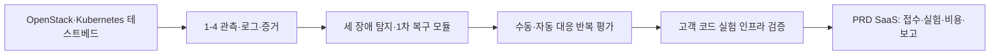
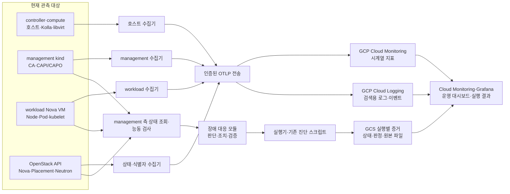

# 기반작업 1-4: 상시 모니터링·로그 수집 아키텍처 제안

- 작성일: 2026-09-23
- 상태: [구현 디렉터리](../../observability/README.md)의 GCP 기반 수집·조회는 [1순위 종합 검증](../foundation-priority1-final-validation-2026-09-24.md)에서 최종 구성의 정상 30분·전체 증감·Pod 실패 후 추적·수집기 및 gateway 중단과 복귀를 통과했다. CAPI/CA 내부 reconcile 메트릭, Grafana 대시보드와 후속 장애 탐지·복구 모듈은 별도 범위다. 아래의 아키텍처 확장안 전체가 구현됐다는 의미는 아니다.
- 범위: [인프라 작업 우선순위](infrastructure-priorities.md)의 1-4 및 이를 이용하는 2-6. 졸업작품에서 구현할 장애 탐지·복구 모듈의 입력과 검증 증거를 마련하고, 그 기반 위에 구축할 PRD 제품의 실험 유효성 판정에도 사용한다. 고객 애플리케이션의 HTTP 성능 계측과 HPA는 각각 별도 선행 작업과 연결한다.
- 현재 환경: GCP controller 1대, compute 2대, controller 안의 management kind, compute 위의 Nova VM으로 구성된 workload Kubernetes. GCP 호스트는 기동 후 10시간 STOP된다.

## 0. 이 작업의 프로젝트 맥락

2026-03-25 **졸업작품 신청서**는 OpenStack 기반 Kubernetes에서 세 가지 대표 장애를 감지하고 1차 복구하는 모듈 프로토타입을 목표로 한다. 대상은 (1) worker NotReady 또는 kubelet/container runtime 이상, (2) 애플리케이션 Pod의 반복 실패나 probe 실패, (3) Ingress controller 이상으로 인한 서비스 접근 실패다. 지표·로그·Events로 탐지 조건을 정하고, 수동 대응과 자동 대응을 반복해 장애 발생부터 정상 서비스 회복까지의 시간과 성공률을 비교한다. 신청서의 모니터링 단계에는 Prometheus/Grafana와 로그 수집이 명시되어 있다.

2026-09-09 [제품 기획서](plan.md)와 [PRD](prd.md)는 외부 고객의 Monolith 코드와 예상 트래픽을 받아 운영 비용 초안, 통제된 성능·용량·병목·확장·복구 실험, 근거 있는 결과를 제공하는 SaaS를 정의한다. 이 문서에서 **기반 환경 포화와 자료 누락을 고객 앱의 성능 한계로 오판하지 않는 것**은 핵심 MVP의 유효성 조건이고, 복구 런북은 P1이다. 고객 서비스의 예상 운영 비용과 이 실험 플랫폼의 운영비는 다른 값이다.

**선후관계는 졸업작품 → PRD 제품**이다. 먼저 OpenStack-Kubernetes 테스트베드와 세 장애의 자동 탐지·1차 복구 모듈을 구축·검증해 고객 소프트웨어를 실험할 인프라를 만든다. 그 위에 PRD의 코드 접수·격리·트래픽 해석·성능/비용 평가·결과 제공 기능을 더한다. 따라서 졸업작품을 PRD와 병렬인 별도 제품으로 취급하지 않는다. 1-4는 졸업작품의 탐지 입력과 복구 효과 증거를 마련하는 단계이며, 그 자체로 탐지 규칙·복구 실행·수동 대비 평가를 완료하지 않는다.

PRD의 FR-25가 P1로 적은 것은 **고객 서비스에 대한 재시작·복구 실험 결과**다. 졸업작품에서 먼저 만드는 **실험 인프라의 장애 대응 모듈**과 책임이 다르다. 고객 코드 수용 전에는 인프라 복구의 안전성과 고객 실행 격리·통신 경로도 별도로 검증해야 한다.

신청서의 물리 서버 3대·worker 2대 이상은 당시 진행계획이다. 현재 저장소의 실행 환경은 GCP의 controller 1대·compute 2대와 workload worker 1~3대다. 따라서 현재 GCP 검증을 물리 서버 테스트베드 완료로 표현하지 않고, 실제 물리 이전은 별도 실행·검증으로 다룬다.

## 1. 결정하려는 것

졸업작품의 세 장애를 구분하고 복구 모듈의 판단·조치·서비스 회복을 재현 가능하게 기록한다. 이어서 PRD의 고객 실험에서 어떤 계층이 먼저 압박받거나 실패했는지, worker 증감 결정부터 Pod 준비까지 어디서 시간이 소요됐는지, 자료가 누락돼 판정을 보류해야 하는지를 확인한다. 수집 범위는 이 질문에 답하는 데 필요한 신호에서 정한다. 수집량과 요금은 그다음에 측정·산정한다.

관측 대상인 OpenStack, management kind, workload Kubernetes와 **중앙 저장·조회 계층을 분리**한다. 현재는 GCP의 관리형 저장소를 중앙 계층으로 사용한다. 물리 서버로 옮긴다면 OpenStack이 관리하지 않는 별도 관리 서버와 저장소로 중앙 계층을 이전한다. 어느 단계에서도 증감·교체 대상인 worker VM에 중앙 저장소를 두지 않는다.

GCP는 현재 실행 환경을 운영하는 곳이지 수집 자료의 영구적인 형식이 아니다. 호스트와 클러스터의 수집은 OpenTelemetry/Prometheus 형식을 우선하고, GCP 인증·전송 설정을 출구에 모은다. 이 방식도 저장소, 대시보드, 경보, 과거 데이터의 자동 이전을 보장하지는 않는다.

**자동 복구의 판단 경로는 GCP 조회 API와 분리한다.** management 측 장애 대응 모듈은 Kubernetes/OpenStack의 현재 상태, Events, 정의된 서비스 능동 검사로 판단하고 조치한다. GCP는 이 과정의 상시 보관·조회·경보·실험 증거를 맡는다. GCP 수신 지연이나 외부 통신 장애가 복구 판단을 멈추거나 늦추지 않도록, 조치에 쓴 원본 상태와 규칙 버전을 실행 증거에 남긴다. 이 모듈의 구체적인 복구 제어권·재시도 정책은 1-3 및 후속 복구 작업에서 구현한다.

## 2. 데이터 흐름과 위치

OTLP 전송은 Google Cloud Telemetry API의 로그·지표 수신 경로를 우선 검증한다. GCP에 수신된 OTLP 로그는 Cloud Logging, 지표는 Cloud Monitoring으로 들어간다. Cloud Monitoring의 GCE 기본 지표와 새로 수집한 호스트 지표가 겹칠 때는 원본·단위·수집 간격을 확인해 조회 화면에 같은 지표를 중복 표시하지 않는다. [Google Cloud OTLP 수신 문서](https://docs.cloud.google.com/stackdriver/docs/otlp/overview)

### 계층별 수집 내용

| 출처 | 지속 수집할 최소 신호 | 주요 질문 |
|---|---|---|
| GCP controller·compute | 실제 CPU 사용률과 압박(PSI), 메모리 사용·압박·OOM, 디스크 여유·I/O·오류, NIC 전송·드롭·오류, 시간 동기화, 수집기 상태; Kolla/Nova/libvirt 및 호스트 journal 오류 | 기반 호스트가 포화되거나 서비스가 실패했는가? |
| OpenStack/Nova | hypervisor·compute service 상태, VM 상태·fault·생성/삭제 시각, flavor, VM→compute 배치, 필요 시 libvirt VM별 CPU·메모리·디스크·네트워크 카운터; Nova·Placement·Neutron 오류 로그 | VM 생성·배치·삭제 중 어디서 막혔는가? 어느 호스트에서 VM이 영향을 받았는가? |
| management kind | CA와 CAPI/CAPO Pod 상태·재시작·자원 사용량, reconcile·API 오류 지표, 관련 로그 및 Kubernetes Events, Machine/OSMachine 상태 전이 | 증감 결정, OpenStack 요청, Machine 준비 중 무엇이 지연됐는가? |
| workload Node·Pod | Node Ready·pressure, allocatable·requests·실제 사용량, Pod Pending/Running/종료·재시작·OOM, 컨테이너 CPU·메모리·파일시스템·네트워크, kubelet/containerd/Calico 로그와 Events | 스케줄링·노드·CNI·고객 Pod 중 어디서 실패했는가? |
| 졸업작품 샘플 서비스·Ingress | 앱 직접 경로와 Ingress 경유 경로의 독립 요청 결과, Service/Endpoint와 Ingress controller 상태·로그, 요청 실패·회복 시각 | 서비스 자체, 내부 연결, 진입 경로 중 어디서 접근이 실패했는가? |
| 실험 실행기 | 실행 ID, 단계 시작/종료, 부하 목표·실제 요청량, 제어 명령, 자료 누락·수집 오류, 정리 결과 | 관측 시각을 실험 단계 및 판정과 어떻게 연결하는가? |

졸업작품에는 **샘플 앱의 정상 서비스 응답**과 직접·Ingress 경유 요청을 먼저 계측해야 한다. Node Ready나 Pod Running만으로 복구 성공을 선언하지 않는다. PRD 제품의 다양한 고객 API에 대한 기능별 HTTP 지연·오류·처리량과 부하 생성기 지표는 이후 고객 앱 통신·성능 시험 단계에서 같은 시간축에 연결한다. 고객 앱 로그·DB 지표는 실제 지원 시나리오와 자료 보존·삭제 정책을 정한 뒤 추가한다. 인프라 지표만으로 고객 앱의 처리 용량을 확정하지 않는다.

### 수집기 배치

1. **GCE 호스트:** controller와 compute마다 호스트 수집기를 둔다. 호스트 journal과 `/var/log/kolla` 같은 기존 파일을 읽고, 시스템 지표와 필요한 OpenStack 서비스 지표를 보낸다. 기존 controller의 Ops Agent 관련 label은 실제 설치·동작 여부를 확인한 뒤 중복 수집을 피한다.
2. **Kubernetes:** management와 workload 클러스터에 각각 Node/컨테이너용 DaemonSet 수집기와 클러스터 상태·이벤트용 수집기를 둔다. 새 worker가 나타나면 자동으로 수집을 시작하고, 삭제 전까지 로그를 외부로 전송한다. 상태 수집기는 읽기 전용 RBAC만 가진다.
3. **OpenStack 식별자:** controller의 읽기 전용 조회 작업이 Nova/Placement/Neutron의 상태·배치 관계를 기록한다. 15초 단위의 모든 자원 카운터를 OpenStack API에 폴링하지 않고, 호스트/libvirt 수집 경로와 상태 조회를 분리한다.
4. **기존 진단:** `workload-diagnostics.sh`와 `cluster-autoscaler-diagnostics.sh`의 실행별 스냅샷을 유지한다. 시계열·로그가 생겨도 장애 시 상세 `describe`, 콘솔 로그, 설정 상태를 남기는 역할은 계속 필요하다.
5. **서비스 능동 검사:** 샘플 앱 바깥의 고정된 관리 위치에서 앱 직접 경로와 Ingress 경유 경로를 같은 정상 응답 조건으로 검사한다. 검사자 자신의 실행 상태·네트워크 오류도 기록해 서비스 장애로 오판하지 않는다. Ingress 경로가 준비되기 전에는 Ingress 장애 시나리오의 수용을 완료로 표시하지 않는다.

현재 Kolla 설정에서는 Prometheus와 Fluentd가 꺼져 있다. 위 수집기와 경로는 별도 구현 대상이며, Kolla 서비스를 켜는 것만으로 이 계층 전체가 수집되지는 않는다.

## 3. 조회·상관관계 계약

모든 자료는 UTC 원본 시각과 수집 시각을 구분한다. 공통 필드는 `environment`, `cluster`, `layer`, `source`, `host`, `namespace`, `resource_name`, `resource_uid` 및 가능한 경우 `nova_server_id`, `machine_uid`, `node_uid`, `pod_uid`다. 로그에는 severity와 원본 컴포넌트를 보존한다. 고정 호스트 지표 전체에 실행 ID를 반복 label로 붙이지 않는다.

실행 시작 시 **실행 ID → 단계별 UTC 구간 → Pod/Node/Machine/Nova ID → compute 호스트** 관계를 별도 불변 manifest에 기록한다. 동적 자원의 실행 소유 label도 기록한다. 이 관계표로 고정 호스트의 시계열을 해당 실행 시간에 맞춰 조회한다. 삭제된 worker의 ID와 마지막 배치 정보도 manifest에 남겨 사후 조회가 가능해야 한다.

운영 화면은 (1) 전체 환경·수집 누락, (2) compute/VM 배치와 압박, (3) management의 CA/CAPI 전이, (4) workload Node/Pod, (5) 실행 ID별 시간축으로 나눈다. 실행 결과에는 해당 구간의 그래프·로그 검색 링크와 판단에 사용한 값·누락 여부를 남긴다. `0`과 `측정 불가`는 별도 상태다.

졸업작품의 Prometheus/Grafana 요구에는 Prometheus 형식 지표·PromQL과 **Grafana 대시보드**를 제공한다. 현재는 GCP 관리형 Prometheus 지표를 중앙 저장소로 쓰고 Grafana는 읽기 전용 화면으로 운영한다. Grafana를 controller의 management 환경에 둘 경우 화면만 그곳에 두고 대시보드 정의는 저장소에 보존한다. controller 장애 시에는 GCP 콘솔에서 직접 조회한다. 학교 평가에 독립 Prometheus 서버 실행 자체가 필요하다고 확인되면, 이 저장 구조를 바꾸기 전에 해당 요구를 별도로 충족한다. [GCP 관리형 지표의 Grafana 조회](https://docs.cloud.google.com/stackdriver/docs/managed-prometheus/query)

초기 수집 간격의 제안은 호스트·VM·Node·Pod의 압박/사용량 **15초**, OpenStack의 상태·배치 관계 **30초**, 로그·Events는 발생 시 전송이다. 이는 비용 한도가 아니라 증감 전후와 짧은 압박 구간을 볼 수 있는지 시험하기 위한 시작값이다. 실제 부하와 수집 지연을 확인해 바꾼다면 버전이 있는 관측 정책으로 기록한다.

### 졸업작품의 세 장애에 필요한 관측과 후속 작업

| 장애 시나리오 | 1-4에서 확보할 탐지·진단 근거 | 별도 구현·검증할 부분 |
|---|---|---|
| worker 비정상 | Node Ready/NotReady 지속, kubelet·containerd 상태와 로그, Machine/Nova VM 상태, compute 호스트 압박, Pod 재배치·서비스 응답 | 장애별 감지 조건, CA와 충돌하지 않는 kubelet 복구 또는 Machine 교체, Ready·실제 통신 복귀 확인. [worker 복구 기반](infrastructure-priorities.md) 8번과 연결 |
| Pod 반복 실패 | restart 수·종료 이유·CrashLoopBackOff, readiness/liveness 결과, Events·컨테이너 로그, Deployment 상태, 요청 성공률 | 재시작/rollout 같은 1차 조치의 적용 조건·재시도 상한·효과 검증. 고객 실행 격리와 Pod 운영 기반이 선행 |
| Ingress 접근 실패 | Ingress controller 상태·로그·라우팅 오류, Service/Endpoint 상태, 앱 직접 경로와 Ingress 경유 경로의 독립 능동 요청 결과 | 접근 경로 구축과 실패 지점 판별, controller 복구 절차와 서비스 정상 응답 확인. [고객 앱 통신 경로](infrastructure-priorities.md) 9번과 연결 |

세 시나리오 모두 `장애 주입 시각 → 실제 증상 시작 → 탐지 → 판단 → 조치 시작/종료 → Node·Pod·서비스 정상 회복`을 별도 사건으로 기록한다. 같은 장애 조건과 성공 기준으로 수동/자동 대응을 반복 비교하고, 복구 실패·수집 누락·조치 부작용도 결과에 남긴다. 자동 복구는 관측과 별개의 제어 기능이며, 1-4 구현만으로 활성화하지 않는다.

복구 모듈을 고객 실험 기반으로 사용할 때는 [제어 충돌 방지](infrastructure-priorities.md)의 1-3과 연결해 CA·수동 조작·장애 주입·자동 복구의 제어권을 정한다. 어떤 모드에서 어떤 조치를 허용했는지 실행 기록에 남기고, 복구가 실패 증거를 지우거나 고객 앱의 문제를 정상으로 보이게 해서는 안 된다. 인프라 자체의 정상 운영 복구와 고객 서비스의 복구 실험은 각각 다른 사건과 판정으로 기록한다.

## 4. 저장·보존·접근

| 자료 | 현재 저장 위치 | 역할·보존 결정 |
|---|---|---|
| 시계열 지표 | Cloud Monitoring의 OTLP/Prometheus 지표 | 대시보드·경보·실행 전후 비교. 서비스의 실제 보존 특성을 확인하고, 보고서에 필요한 결정 근거는 실행 증거로 별도 고정 |
| 인프라 로그·Events | 별도 Cloud Logging log bucket | 시간·컴포넌트·자원 ID로 검색. 최초 30일 검색 보존을 제안하며, 실제 조사 기간에 맞춰 확정. 향후 고객 코드 로그는 별도 접근·보존 경계 |
| 실행 증거 | 서울 리전 Cloud Storage bucket의 `environment/run_id/` | 기존 로컬 `artifacts/`의 결과·식별자 관계표·진단 파일·판정·수집 오류를 반출. 최초 90일 보존을 검토하고 고객 자료 정책과 함께 확정 |

30일/90일은 현재 요구에서 확정된 수치가 아니라 검토용 초깃값이다. 외부 고객 코드 수용 전에는 코드·로그·보고서별 보존 기간과 삭제 범위를 별도 정책으로 확정해야 한다. Cloud Logging bucket의 보존 기간은 설정할 수 있으며 기본값은 30일이다. 관리형 Prometheus 지표는 현재 24개월 보존되므로 고객 식별 정보나 비밀 값을 지표 label에 넣지 않는다. [Cloud Logging 보존 설정](https://docs.cloud.google.com/logging/docs/buckets), [관리형 Prometheus 보존](https://docs.cloud.google.com/stackdriver/docs/managed-prometheus), [제품 자료 보존 요구](prd.md)

전송 전 토큰·자격 증명·고객 비밀 값은 가리고, 원문에 접근할 수 있는 서비스 계정과 조회 권한을 분리한다. host, management, workload 수집기는 필요한 범위만 읽고 쓰기 권한은 중앙 수신 API에 한정한다. GCE 호스트는 붙어 있는 전용 서비스 계정의 권한과 OAuth scope를 검증한다. Nova VM 위의 자체 Kubernetes는 GCE 메타데이터 자격을 가정하지 않는다. 두 클러스터의 수집기에는 Kubernetes ServiceAccount 토큰을 이용한 **Workload Identity Federation**을 우선 검증하고 장기 서비스 계정 키는 배포하지 않는다. 클러스터의 토큰 발행·서명키 변경 후에도 전송되는지 확인한다. [자체 Kubernetes용 WIF](https://docs.cloud.google.com/iam/docs/workload-identity-federation-with-kubernetes)

## 5. 장애와 수집 누락의 처리

- 수집기는 재시작·전송 실패를 스스로 기록하고, 제한된 로컬 디스크 큐로 일시적인 외부 API 장애를 견딘다. 큐 포화·드롭·전송 지연은 숨기지 않고 지표와 실행 결과에 남긴다.
- 수집 대상이 조용한 것과 수집기가 죽은 것을 구분하기 위해 host/cluster/collector별 마지막 수신 시각과 기대 대상 목록을 대조한다. `up` 확인만으로 로그 수집 성공을 주장하지 않는다.
- controller 장애 중에도 compute GCE 호스트 수집기는 각자 외부로 보낼 수 있는 경로를 검증한다. **Nova VM은 Neutron의 controller 경유 라우팅에 의존할 수 있으므로**, VM 수집기에 자체 GCP 인증이 있어도 controller 장애 중 외부 전송이 된다고 가정하지 않는다. 실제 라우팅 장애를 주입해 경로를 확인하고, 전송 실패 시 버퍼 한계·손실 범위와 별도로 호스트/OpenStack 측에 남는 증거를 기록한다. VM 삭제 전에 전송되지 않은 로컬 큐는 유실될 수 있다.
- 계획된 10시간 STOP은 실행 종료 사건으로 기록한다. STOP 뒤 호스트 내부 지표가 멈춘 것은 정상일 수 있지만, GCP 인스턴스 상태와 마지막 수신 시각으로 예기치 않은 중단과 구분한다. 전체 환경이 내려간 상태는 호스트 내부 수집기만으로 감지할 수 없다.
- 장애 대응 모듈이 놓이는 controller 자체가 중단되면 세 시나리오의 자동 대응도 실행되지 않는다. controller 상태는 GCP 측에서 별도로 감지·기록하되, controller 자동 복구를 졸업작품의 세 장애 수용 범위에 포함했다고 주장하지 않는다.
- 수집으로 controller/compute/worker의 CPU·메모리·디스크에 유의미한 압박이 생기면 측정 자체가 실험을 바꾼다. 수집기 자원 사용량과 관측 전후 성능을 검증해 배치나 구현을 조정한다. 필요한 자료를 조용히 삭제해 통과 처리하지 않는다.

## 6. 물리 서버 이전 시 위치와 변경 범위

물리 환경에서는 OpenStack controller·compute와 독립된 관리망의 **별도 관측 서버와 지속 저장소**에 중앙 지표 DB, 로그 검색 저장소, 대시보드·경보를 둔다. 그 서버를 관측 대상 OpenStack의 Nova VM이나 workload worker에 올리지 않는다. 관측 서버와 같은 현장의 전원·네트워크가 모두 끊기는 사고는 다른 위치의 간단한 heartbeat/접속 확인 경로가 감지한다. 백업은 관측 서버와 다른 장애 영역에 둔다.

호스트·Kubernetes 수집기, 신호 이름·단위, 리소스 식별자 관계표와 실행 증거 형식은 가능한 한 유지한다. 바뀌는 것은 OTLP 전송 목적지, 인증·네트워크, 중앙 저장 제품, 대시보드·경보 구현이다. GCP에 남아 있는 과거 지표/로그를 물리 저장소로 옮길지, 과거 실행 증거와 조회 링크를 일정 기간 병행할지 별도 이전 계획을 세운다. 이 저장소의 현재 ADR-0013은 GCP만 실행 환경으로 승인하므로, 실제 물리 이전은 새 운영 기준과 ADR에서 다룬다.

## 7. 구현 순서와 수용 시험

1. **관측 계약 고정:** 졸업작품의 세 장애에 필요한 탐지 조건·복구 성공 증거와 PRD의 실험 유효성 질문에서 지표·로그·식별자·단위·수집 지연·보존 정책을 목록화한다. 정상/증감/실패 구간에서 읽을 화면과 결측 처리 규칙을 먼저 정의한다.
2. **GCP 수신 경계 마련:** Telemetry API, Monitoring, 인프라 Logging bucket, 실행 증거 bucket, 최소 IAM 권한·전용 서비스 계정, WIF, 네트워크 송신 경로를 구성한다. 현재 호스트의 서비스 계정·scope, 기존 Ops Agent 동작을 먼저 확인한다.
3. **계층별 수집:** 호스트→OpenStack 식별자→management CA/CAPI→workload Node/Pod 순서로 붙인다. 매 단계마다 실제 원본과 GCP 조회값을 비교하고 중복·누락을 확인한다.
4. **실행 연계:** 실행 ID와 자원 ID 관계표, 단계 구간, 그래프·로그 링크, 증거 반출·체크섬을 기존 결과 경로에 추가한다. 원본 시각과 수집 시각 차이를 확인한다.
5. **수용 시험:** 정상 기준선, `1→2→3→2→1` 증감, 의도적인 수집기 중단·API 전송 실패, 계획 STOP에서 자료를 조회한다. worker NotReady, Pod 반복 실패, Ingress 장애는 해당 선행 기반이 준비되면 각각 별도 시나리오로 주입한다. 정상·증감·실패 각 구간에 CPU·메모리·디스크·네트워크 압박, 해당 로그, 자료 누락 상태가 보이는지 확인한다. GCP 전송을 끊어도 장애 판단 경로가 작동하는지, controller/Neutron 장애에서 어떤 증거가 남는지 확인한다. 소유 자원 정리 뒤에도 삭제 자원의 자료를 조회한다. 복구 시간·성공률 비교는 장애 대응 모듈 단계의 수용 시험으로 분리한다.
6. **비용·부하 검증:** 필요한 자료를 모두 수집한 상태에서 실제 초당 시계열 수, 로그 GiB/일, 증거 GiB/실행, 수집기 CPU·메모리·디스크를 측정해 월 요금과 실험 영향도를 계산한다. 예상보다 높으면 중복·불필요한 신호를 의미 기준으로 검토하고, 필요한 신호는 저장 방식 변경까지 비교한다.

## 8. 구현 전 확인할 결정

- 졸업작품의 세 장애에 대해 1-4가 제공할 관측과 후속 복구 모듈의 책임 경계. 기반 포화와 증감 추적은 포함하고, 고객 HTTP/DB 판정은 해당 선행 작업과 연결한다.
- 인프라 로그 검색 보존 기간, 실행 증거 보존 기간 및 고객 자료의 별도 정책.
- 자체 Kubernetes WIF와 Telemetry API의 이 환경 실증 결과, 특히 worker 교체·토큰 갱신·외부 API 일시 장애.
- 실측 수집량과 controller/compute 여유에 따른 수집기 배치 조정.

이 문서의 제품·API 전제는 [Google Cloud OTLP 수신](https://docs.cloud.google.com/stackdriver/docs/otlp/overview), [자체 Kubernetes WIF](https://docs.cloud.google.com/iam/docs/workload-identity-federation-with-kubernetes), [OpenTelemetry Collector](https://opentelemetry.io/docs/collector/)의 현재 문서에 근거한다. 구현할 때 버전·권한·지역 지원 여부를 다시 확인한다.
