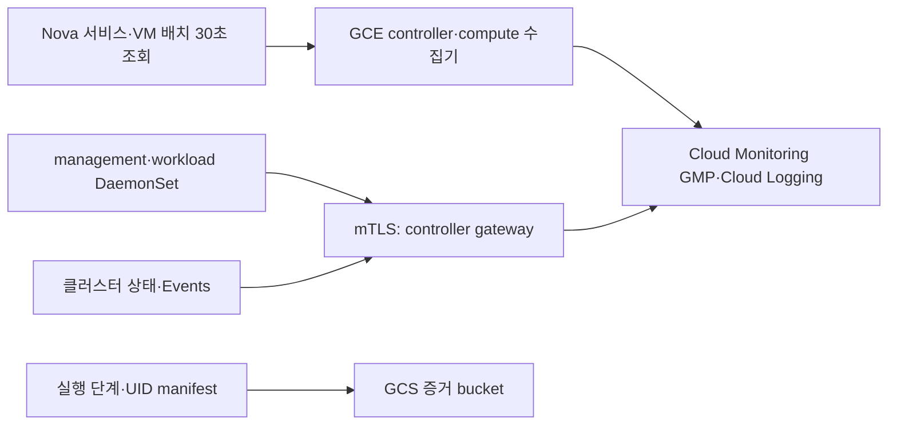

# 기반작업 1-4: 상시 관측 구현

이 디렉터리는 [1-4 아키텍처](../docs/product/monitoring-logging-architecture.md)의 배포 입력이다. **2026-09-24 GCP 배포와 정상 구간의 실측 수집을 확인했다.** 정확한 결과와 남은 수용 시험은 [라이브 검증 기록](live-validation-2026-09-24.md)에 있다. 증감·장애 구간 수용과 Grafana 화면은 아직 완료하지 않았다.

## 배치와 데이터 계약



| 계층 | 지표/로그 | 간격·연결 키 |
|---|---|---|
| controller·compute | OpenTelemetry hostmetrics CPU/메모리/로드/디스크/네트워크/페이징, syslog, Kolla 파일, 1분 heartbeat | 15초. `environment`, `service.instance.id`(호스트), UTC |
| OpenStack | Nova compute service·hypervisor·server 상태/배치의 허용된 필드만 JSONL | 약 30초. Nova server ID, compute host, UTC. 조회 실패도 별도 기록 |
| management·workload | node/Pod/container/volume·파일시스템 지표, Pod 로그, Node/Pod 상태 지표, Events | 15초 지표, 발생 시 로그. 클러스터·node·Pod 경로/UID |
| workload Nova VM | hostmetrics, kubelet/containerd journal | DaemonSet이 새 노드에 자동 배치. VM→Machine→Node 매핑은 실행 manifest와 Nova 조회로 연결 |
| 자동 증감 실행 | 단계 UTC 구간, Machine/OSMachine/Node/Nova/실행 소유 Pod UID, 누락된 조회 | 기존 `autoscaler_cycle.py`가 끝날 때 `observability-manifest.json`을 작성 |

Cloud Monitoring의 `prometheus.googleapis.com/*` 시계열을 PromQL·Metrics Explorer에서 조회한다. Cloud Logging의 `osk8s-otel` 로그는 서울 리전 `osk8s-observability` bucket으로 라우팅한다. GCS `gs://osk8s-<project-number>-evidence/<environment>/<run-id>/`에는 실행 manifest와 결과만 업로드한다. 상세 진단 파일은 현재 로컬 `artifacts/`에 남는다.

졸업작품 자동 복구 모듈은 이 GCP 저장소를 조회해 조치하지 않는다. Kubernetes/OpenStack의 현재 상태와 서비스 능동 검사로 판단하고, GCP는 재현·감사·비교 근거를 보존한다. GCP 전송 또는 controller 장애로 workload 로그가 밀리면 로컬 큐와 `missing_data`로 드러나야 한다. controller가 중단된 동안 Nova guest→GCP 경로도 멈춘다. GCE compute 수집기는 각자 GCP에 전송한다.

## GCP에 적용할 변경

`gcp-setup.sh apply cloud-gcp-amd64`의 변경 내용은 다음과 같다. 세 GCE 호스트가 모두 중지된 상태인지 먼저 검사한다.

1. 이미 사용 중인 Logging, Monitoring, Telemetry, IAM, Storage API의 활성화를 확인한다.
2. `osk8s-telemetry` 서비스 계정을 만들고 프로젝트에서 `roles/logging.logWriter`, `roles/monitoring.metricWriter`만 부여한다.
3. 서울 리전에 Cloud Logging `osk8s-observability` bucket(검색 보존 30일)과 `log_id("osk8s-otel")` sink를 만든다. 전용 bucket 유입을 확인한 뒤 `gcp-setup.sh dedupe`로 `_Default` sink에서 이 로그 ID만 제외한다.
4. 서울 리전에 공개 접근 차단·균일 권한의 GCS 증거 bucket을 만들고 해당 계정에 bucket 범위 `roles/storage.objectCreator`를 준다. 자동 삭제는 설정하지 않는다.
5. 중지된 controller/compute 3대에 이 계정을 `cloud-platform` OAuth scope로 붙인다. 실권한은 위 IAM 역할로 제한한다. 기존에 다른 계정이 있으면 중단한다.

호스트 배포는 Docker 기반 OpenTelemetry Collector Contrib `0.140.0`을 systemd 서비스로 설치한다. management와 workload에는 동일 버전의 노드 DaemonSet과 클러스터 상태 Deployment를 설치한다. Nova guest에는 GCP 키를 복사하지 않는다. guest 수집기는 로컬에서 만든 클라이언트 인증서로 controller의 `10.20.0.10:4317`에 mTLS로 전송한다. CA와 키는 `.state/<environment>/secrets/observability/`에 0600으로 저장하며 Git에 넣지 않는다. 서버/클라이언트 인증서는 365일 후 갱신이 필요하다.

로그 전송 직전에 토큰·암호 등 일반적인 패턴을 가리는 processor를 적용한다. 임의의 고객 로그에서 모든 비밀을 가릴 수 있다고 보장하지 않는다. 외부 고객 코드를 넣기 전에는 고객 로그의 수집 범위·접근권·보존·삭제 정책과 별도 격리를 확정해야 한다. 현재 kubelet TLS 서버 인증서 검증은 수집기 설정에서 건너뛰므로, 실제 클러스터 인증서를 확인해 CA 검증으로 교체해야 한다.

## 적용·조회 순서

최초 설치 때는 멈춘 호스트에서 GCP 리소스를 구성한다. 이후 기존 10시간 자동 STOP 정책을 유지하면서 호스트를 켜고, OpenStack이 `SHUTOFF`로 남겨둔 현재 CAPI VM만 시작한 뒤 설치·검증한다. `make gcp-openstack-recover`는 Keystone·Placement·Nova를 확인하지만 guest VM을 시작하지 않는다.

```bash
make observability-gcp-status
make observability-gcp-setup CONFIRM=cloud-gcp-amd64
make gcp-start
make gcp-openstack-recover
make observability-workload-guests-start
make observability-hosts-install
make observability-clusters-install
make observability-hosts-status
make observability-clusters-status
make observability-verify
make observability-gcp-dedupe CONFIRM=cloud-gcp-amd64
```

조회는 [Metrics Explorer](https://console.cloud.google.com/monitoring/metrics-explorer?project=openstack-k8s)에서 PromQL로 `system_*`·`k8s_*` 시계열을, [Logs Explorer](https://console.cloud.google.com/logs/query?project=openstack-k8s)에서 전용 bucket과 `log_id("osk8s-otel")`를 사용한다. `observability/verify-live.py --start <UTC> --end <UTC>`는 세 호스트와 두 클러스터의 지표, Node Ready·Pod phase·Deployment 가용성, heartbeat·Nova·Kolla·Pod·Event 로그를 조회한다. 최근 시계열이 5분 이상 오래됐거나 필수 자료가 없으면 `missing_data`다. 실행별 manifest는 해당 구간과 UID 필터에 사용한다.

자동 증감 실행 후에는 `make observability-publish-run RUN_DIR=/absolute/path/to/autoscaler-cycle-...`로 **허용된 manifest·result만** GCS에 보낸다. 과거 자료를 인덱싱하려면 `observability/build-run-manifest.py <run-dir>`를 한 번 실행한다. 이미 생성된 manifest는 덮어쓰지 않는다.

## 실제 수용 시험

1. 정상 30분: host 3대, management, workload의 CPU·메모리·디스크·네트워크·Node/Pod 지표와 host heartbeat·Pod/Events 로그를 Cloud Monitoring/Logging에서 조회한다. collector 로그에 내보내기 실패·큐 드롭이 없는지 본다.
2. 증감: `1→2→3→2→1→2→1` 실행에서 각 단계 UTC 구간·Machine/Node/Nova/Pod UID·Nova→compute 배치가 조회되는지 본다. 삭제된 worker도 마지막 ID로 과거 로그가 찾아져야 한다. 실패한 시점의 `missing_data`는 실패 판정에 포함한다.
3. 장애: worker NotReady 또는 Pod 반복 실패를 통제된 조건으로 주입해 장애 전·중·후 지표/로그와 서비스 회복 시각을 확인한다. Ingress 경로와 능동 검사는 기반작업 9번이 준비된 뒤 시험한다.
4. collector/전송 장애: controller 또는 수집기 중단 시 host와 guest의 자료 누락·복귀, 디스크 큐 포화 여부를 별도 실패로 기록한다.

현재 **미검증**: 최종 구성에서 끊김 없는 정상 30분, 새 worker 생성·삭제 중 과거 UID 조회, 장애 주입과 복구, collector/전송 중단 시 큐·누락·복귀, CAPI/CA 내부 Prometheus endpoint, Grafana 대시보드. Ingress 경로의 능동 검사는 기반작업 9번 이후에 시험한다. CA/CAPI의 Pod 상태·Events·로그는 수집하지만 controller 내부 reconcile 메트릭 scrape는 아직 없다. 기존 controller Ops Agent는 중복 수집을 피하려고 비활성화했고 정책 label도 제거했다.

보존: Cloud Logging 30일, Cloud Monitoring Managed Prometheus는 서비스 정책에 따름, GCS 증거는 자동 삭제 없음, 호스트 JSONL은 일 단위 회전 7개를 유지한다. GCS 고객 자료 보존은 PRD 제품의 정책을 정할 때 별도로 확정한다. [OTel 수신](https://docs.cloud.google.com/stackdriver/docs/otlp/overview), [GMP exporter](https://github.com/open-telemetry/opentelemetry-collector-contrib/tree/main/exporter/googlemanagedprometheusexporter), [Cloud Logging bucket](https://docs.cloud.google.com/logging/docs/buckets).
